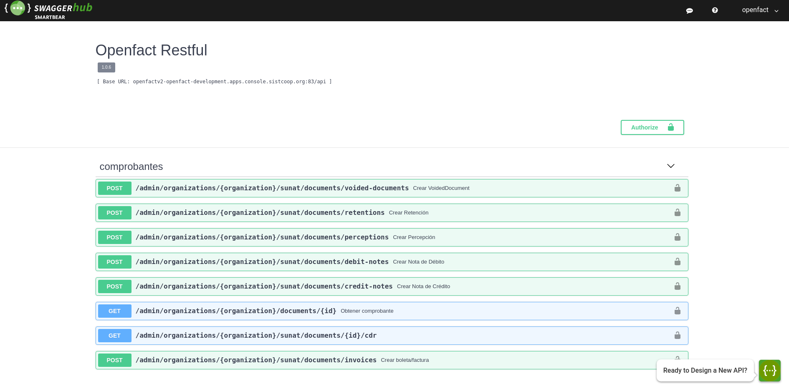

# openfact-java-client


### Catalogs

1. [Catalogs part 1](docs/pdf/Catalogos%20Parte%201.pdf)
1. [Catalogs part 2](docs/pdf/Catalogos%20Parte%202.pdf)

### Maven users

Add this dependency to your project's POM:

```xml
<dependency>
    <groupId>org.sistcoop</groupId>
    <artifactId>openfact-java-client</artifactId>
    <version>${version}</version>
</dependency>
```

### Gradle users

Add this dependency to your project's build file:

```groovy
compile "org.sistcoop:openfact-java-client:${version}"
```

## Getting Started

Please add the needed dependencies and execute the following Java code:

```java

public class ComprobantesApiExample {

    public static void main(String[] args) {
        String openfactUrl = "http://openfacturl";
        String tokenServerUrl = "http://securityserverutl";
        String refreshToken = "mirefreshtoken";

        TokenManager tokenManager = OpenfactClientFactory.getTokenManager("openfact-web-console", tokenServerUrl, refreshToken);
        DocumentsService service = OpenfactClientFactory.getDocumentsService(openfactUrl, tokenManager);
        OrganizationClient client = new OrganizationClient("miempresa", service);

        DocumentResponseRepresentation invoice = client.createInvoiceAndParseAsEntity(getInvoice(), true);
        System.out.println("Document created:" + invoice.getDocumentId());
    }
    
    public static DocumentRequestRepresentation getInvoice() {
        DocumentRequestRepresentation invoice = new DocumentRequestRepresentation();

        invoice.setFechaDeEmision(new Date());

        invoice.setTipo("01"); // Tipo de Documento (Boleta/factura)
        invoice.setEntidadDenominacion("Juan Perez"); // Nombre del cliente
        invoice.setEntidadEmail("micorreo@gmail.com"); // Email del cliente
        invoice.setEntidadNumeroDeDocumento("10254125878"); // Numero de documento del cliente (RUC/DNI)
        invoice.setEntidadTipoDeDocumento("6"); // Tipo de Documento del cliente (RUC/DNI)
        invoice.setEnviarAutomaticamenteASunat(true);
        invoice.setEnviarAutomaticamenteAlCliente(true);
        invoice.setIgv(new BigDecimal(18)); // IGV Aplicado a la operacion expresada en porcentaje 18%
        invoice.setMoneda("PEN"); // Moneda nacional
        invoice.setObservaciones("Mis observaciones");

        invoice.setOperacionGratuita(false); // Si la operacion es gratuita
        invoice.setTotalGratuita(BigDecimal.ZERO);

        invoice.setTotalGravada(new BigDecimal(120_100));
        invoice.setTotalExonerada(BigDecimal.ZERO);
        invoice.setTotalInafecta(BigDecimal.ZERO);

        invoice.setTotal(new BigDecimal(141_718));
        invoice.setTotalIgv(new BigDecimal(21_618));
        invoice.setTotalOtrosCargos(BigDecimal.ZERO); // Otros cargos aplicados
        invoice.setDescuentoGlobal(BigDecimal.ZERO); // Descuentos aplicados

        // Detalle de la factura
        List<LineRepresentation> lines = new ArrayList<>();
        LineRepresentation line1 = new LineRepresentation();
        LineRepresentation line2 = new LineRepresentation();
        lines.add(line1);
        lines.add(line2);

        line1.setCantidad(new BigDecimal(2));
        line1.setDescripcion("Carro Toyota ultimo modelo");
        line1.setTipoDeIgv("10"); // Codigo de operacion (Gravado - Operacion Onerosa)
        line1.setValorUnitario(new BigDecimal(60_000)); // Precio unitario sin igv
        line1.setIgv(new BigDecimal(21_600)); // Igv aplicado al item
        line1.setPrecioUnitario(new BigDecimal(70_800)); // Precio unitario con igv
        line1.setSubtotal(new BigDecimal(120_000)); // Subtotal sin igv
        line1.setTotal(new BigDecimal(141_600)); // Subtotal con igv

        line2.setCantidad(new BigDecimal(1));
        line2.setDescripcion("Llanta doble filo original");
        line2.setTipoDeIgv("10"); // Codigo de operacion (Gravado - Operacion Onerosa)
        line2.setValorUnitario(new BigDecimal(100)); // Precio unitario sin igv
        line2.setIgv(new BigDecimal(18)); // Igv aplicado al item
        line2.setPrecioUnitario(new BigDecimal(118)); // Precio unitario con igv
        line2.setSubtotal(new BigDecimal(100)); // Subtotal sin igv
        line2.setTotal(new BigDecimal(118)); // Subtotal con igv

        // Return result
        invoice.setDetalle(lines);
        return invoice;
    }
}

```

## Documentation for API Endpoints

All URIs are relative to *https://localhost:8080/api*

Class | Method | HTTP request | Description
------------ | ------------- | ------------- | -------------
*ComprobantesApi* | [**createCreditNote**](docs/ComprobantesApi.md#createCreditNote) | **POST** /admin/organizations/{organization}/sunat/documents/credit-notes | Crear Nota de Crédito
*ComprobantesApi* | [**createDebitNote**](docs/ComprobantesApi.md#createDebitNote) | **POST** /admin/organizations/{organization}/sunat/documents/debit-notes | Crear Nota de Débito
*ComprobantesApi* | [**createInvoice**](docs/ComprobantesApi.md#createInvoice) | **POST** /admin/organizations/{organization}/sunat/documents/invoices | Crear boleta/factura
*ComprobantesApi* | [**createPerception**](docs/ComprobantesApi.md#createPerception) | **POST** /admin/organizations/{organization}/sunat/documents/perceptions | Crear Percepción
*ComprobantesApi* | [**createRetention**](docs/ComprobantesApi.md#createRetention) | **POST** /admin/organizations/{organization}/sunat/documents/retentions | Crear Retención
*ComprobantesApi* | [**createVoidedDocument**](docs/ComprobantesApi.md#createVoidedDocument) | **POST** /admin/organizations/{organization}/sunat/documents/voided-documents | Crear VoidedDocument
*ComprobantesApi* | [**getCdr**](docs/ComprobantesApi.md#getCdr) | **GET** /admin/organizations/{organization}/sunat/documents/{id}/cdr | 
*ComprobantesApi* | [**getDocumentById**](docs/ComprobantesApi.md#getDocumentById) | **GET** /admin/organizations/{organization}/documents/{id} | Obtener comprobante


## Documentation for Models

 - [CreditNote](docs/CreditNote.md)
 - [DebitNote](docs/DebitNote.md)
 - [DespatchAdvice](docs/DespatchAdvice.md)
 - [DocumentResponseRepresentation](docs/DocumentResponseRepresentation.md)
 - [Invoice](docs/Invoice.md)
 - [Line](docs/Line.md)
 - [Perception](docs/Perception.md)
 - [PerceptionRetentionLine](docs/PerceptionRetentionLine.md)
 - [PostalAddress](docs/PostalAddress.md)
 - [Retention](docs/Retention.md)
 - [VoidedDocument](docs/VoidedDocument.md)
 - [VoidedDocumentLine](docs/VoidedDocumentLine.md)


## Documentation for Authorization

Authentication schemes defined for the API:
### keycloak

- **Type**: API key
- **API key parameter name**: Authorization
- **Location**: HTTP header


## Recommendation

It's recommended to create an instance of `OrganizationClient` per thread in a multithreaded environment to avoid any potential issues.

## More info

All the information you can find here come from our swagger repository:




